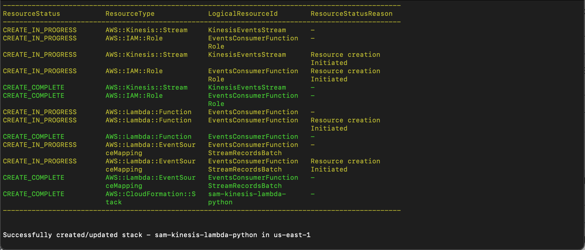

# AWS Lambda Kinesis Consumer for Cart Events (Python)

This project contains source code and supporting files for a serverless application that you can deploy with the SAM CLI. It includes the following files and folders.
The application uses several AWS resources, including Lambda functions and a Kinesis Data Stream. These resources are defined in the `template.yaml` file in this project. The main Lambda function code written in app.py file, it handles the decoding of Kinesis records, processing events, and logging the results.
This Python version serves as a simplified alternative to the [AWS Lambda Kinesis Consumer for Cart Events](https://github.com/ssuljo/aws-sam-kds-lambda-java).

## Prerequisites
Before deploying and running this project, ensure you have the following prerequisites:
- **AWS Account**: You must have an AWS account to deploy and execute Lambda functions.
- **AWS CLI**: Install and configure the AWS Command Line Interface (CLI) to manage AWS resources and configure your credentials.
- **AWS SAM CLI**: Install the AWS Serverless Application Model (SAM) CLI to package and deploy your Lambda function.
- **Python 3.9**: Ensure you have Python 3.9 installed on your local development environment.

## Deployment

To build and deploy the Python Lambda function for the first time, follow these steps:

1. Clone this repository to your local machine.

2. Navigate to the project directory containing the `template.yaml` file.

3. Build the application using the AWS SAM CLI:

```bash
sam build
```

4. Deploy the application using the AWS SAM CLI:

```bash
sam deploy --guided
```
During deployment, you'll be prompted for configuration settings:

* **Stack Name**: The name of the stack to deploy to CloudFormation. This should be unique to your account and region, and a good starting point would be something matching your project name.
* **AWS Region**: The AWS region you want to deploy your app to.
* **KinesisStreamName**: The Kinesis Data Stream name
* **Confirm changes before deploy**: If set to yes, any change sets will be shown to you before execution for manual review. If set to no, the AWS SAM CLI will automatically deploy application changes.
* **Allow SAM CLI IAM role creation**: Many AWS SAM templates, including this example, create AWS IAM roles required for the AWS Lambda function(s) included to access AWS services. By default, these are scoped down to minimum required permissions. To deploy an AWS CloudFormation stack which creates or modifies IAM roles, the `CAPABILITY_IAM` value for `capabilities` must be provided. If permission isn't provided through this prompt, to deploy this example you must explicitly pass `--capabilities CAPABILITY_IAM` to the `sam deploy` command.
* **Save arguments to samconfig.toml**: If set to yes, your choices will be saved to a configuration file inside the project, so that in the future you can just re-run `sam deploy` without parameters to deploy changes to your application.

## Deployment Output

After successfully deploying the AWS Lambda Kinesis Consumer using the `sam deploy` command, you will see output similar to the following:


Here's a breakdown of what each line represents:

- `AWS::IAM::Role`: The IAM role created for the Lambda function.
- `AWS::Kinesis::Stream`: The Amazon Kinesis stream used by the application.
- `AWS::Lambda::Function`: The AWS Lambda function itself.
- `AWS::Lambda::EventSourceMapping`: The event source mapping between the Lambda function and the Kinesis stream.
- `AWS::CloudFormation::Stack`: The AWS CloudFormation stack that includes all the deployed resources.

This output confirms that the deployment was successful, and all the necessary resources have been created in your AWS environment.

## Usage

The AWS Lambda function (EventsConsumer) will automatically consume cart events from the specified Kinesis stream. You can view the processed events in the AWS Lambda logs.

## Monitoring

You can monitor the AWS Lambda function's execution, view logs, and set up alerts using AWS CloudWatch.

## Error Handling

The Lambda function includes basic error handling to log errors when decoding cart abandonment events. You can extend error handling and logging as needed to suit your specific use case.

## Cleanup

To delete the sample application, use the AWS CLI. Assuming you used your project name for the stack name, you can run the following:

```bash
sam delete --stack-name sam-kinesis-lambda-python
```